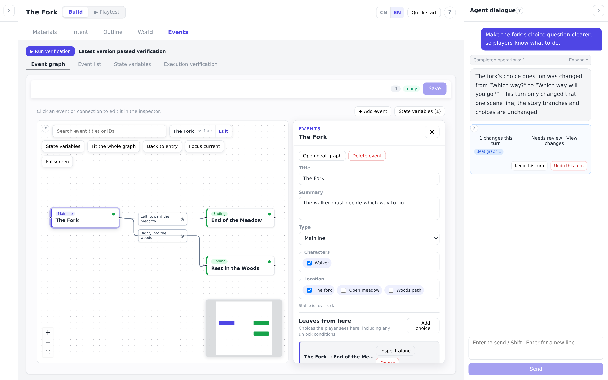
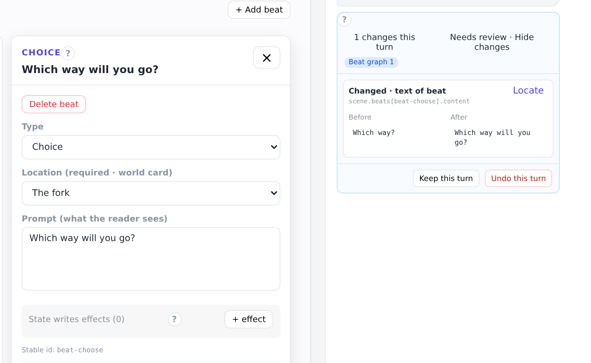
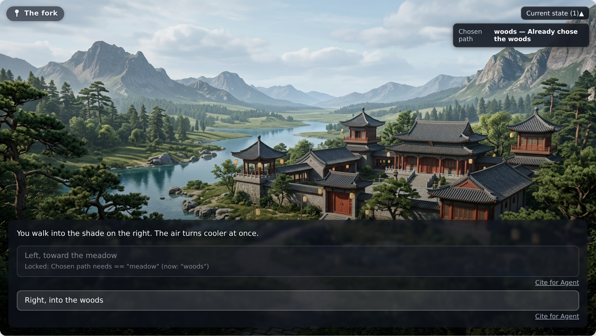

# NarrativeSteward


<!-- Link the badge to the paper's arXiv URL when available. -->

<a href="README.md"><kbd>English</kbd></a> · <a href="README.zh-CN.md"><kbd>简体中文</kbd></a>

**An AI-assisted workspace for creating and playtesting interactive stories.**

Turn story ideas and source material into world cards, connected events and branching scenes. Work with an AI assistant, inspect what changed, and play through the story to see how choices shape later paths. The interface and built-in tutorials support English and Chinese.

## Explore the workspace

Organize the story as an event graph. Select an event to edit its summary, characters and locations, then open its scene to develop dialogue and choices. The assistant works alongside these editors in the same workspace.



*The Fork example: one decision leads to two endings, each unlocked by the player's chosen path.*

## Review and guide changes

Ask for a revision in natural language, then inspect the saved changes. Compare the before and after text, locate the affected part of the story, and keep or undo the turn. You can continue editing directly or give the assistant another instruction.



*The example revision clarifies the question at the fork while preserving the existing branches.*

## Check and play through your story

Check story structure and state-dependent paths, then try the story from the player's perspective. Choices update state, which determines which later routes are available. Cite a playtest choice in the dialogue to discuss it with the assistant.



*Choosing the woods opens the woods route and leaves the meadow route locked.*

## Run locally

Use Python 3.12 and Node.js 24 LTS (24.21.0 or newer within the 24.x series). The repository includes `.python-version` and `.nvmrc`; with nvm, run `nvm install` and `nvm use` from the repository root. Use a dedicated Python environment:

```bash
python3.12 -m venv .venv
source .venv/bin/activate
python -m pip install -r code/backend/requirements.lock
python -m pip install --no-build-isolation -c code/backend/requirements.lock -e './code/backend[api]'
cp code/backend/.env.example code/backend/.env
```

### Configure `.env`

Edit `code/backend/.env` after copying [`.env.example`](code/backend/.env.example). Lines beginning with `#` are comments: remove the `#` to enable a setting. Optional values below are used when the corresponding variable is **unset**; leave unused settings commented out rather than assigning an empty value. Restart the backend after changing this file. Variables already exported in your shell take precedence over `.env`.

#### Chat model

The authoring assistant requires all three settings:

```dotenv
OPENAI_API_KEY=your_api_key
OPENAI_BASE_URL=your_base_url
OPENAI_MODEL=your_model_name
```

| Setting | What to enter |
| --- | --- |
| `OPENAI_API_KEY` | Your provider's API key or token. |
| `OPENAI_BASE_URL` | The full API base URL, for example `https://your-gateway/v1`; do not append `/chat/completions`. |
| `OPENAI_MODEL` | The model identifier provided by that service. The model and endpoint must support streaming and tool calling. |

There is no default chat model or endpoint. You can leave these settings unconfigured to explore tutorials, edit projects manually, check story structure and state, and playtest existing stories.

#### Image generation (optional)

Image generation creates **character portraits** and **location backgrounds** for world cards, which are also used during playtesting. The image buttons and the assistant's image tool share the same configuration. It is optional: without an image key you can still use the chat assistant, upload existing images and playtest.

Set the image service separately, even if it uses the same key and gateway as chat:

```dotenv
IMAGE_API_KEY=your_image_api_key
IMAGE_BASE_URL=your_image_base_url
IMAGE_MODEL=your_image_model_name
IMAGE_SIZE=1024x1024
```

| Setting | Behavior when unset |
| --- | --- |
| `IMAGE_API_KEY` | Image generation is unavailable. The chat API key is not reused automatically. |
| `IMAGE_BASE_URL` | The SDK checks `OPENAI_BASE_URL`, then defaults to `https://api.openai.com/v1`. **Set it explicitly** to select the intended image service. Use the API base URL, without `/images/generations`. |
| `IMAGE_MODEL` | Uses the project's default, `gpt-image-2`. Set the model identifier supported by your image provider. |
| `IMAGE_SIZE` | Uses `1024x1024` (width × height in pixels). Supported sizes depend on the selected model. |

The service must support the OpenAI-compatible Images generation API, accept PNG output and return Base64 image data (`b64_json`). A service that only supports chat or only returns an image URL is insufficient for the current image workflow.

**Character and location overrides** let you use different models, sizes and backgrounds through the same image service:

| Purpose | Character portrait | Location background | Fallback when unset |
| --- | --- | --- | --- |
| Model | `IMAGE_CHARACTER_MODEL` | `IMAGE_LOCATION_MODEL` | `IMAGE_MODEL`, then `gpt-image-2` |
| Size | `IMAGE_CHARACTER_SIZE` | `IMAGE_LOCATION_SIZE` | `IMAGE_SIZE`, then `1024x1024` |
| Background | `IMAGE_CHARACTER_BACKGROUND` | `IMAGE_LOCATION_BACKGROUND` | No background parameter is sent; the model decides. |

Each override applies independently. For example, setting only `IMAGE_CHARACTER_SIZE` changes portrait dimensions while keeping the common image model. All image requests still use `IMAGE_API_KEY` and `IMAGE_BASE_URL`.

For a provider that supports the following models and parameters, this configuration requests transparent portrait images and opaque landscape backgrounds:

```dotenv
IMAGE_CHARACTER_MODEL=gpt-image-1
IMAGE_CHARACTER_SIZE=1024x1536
IMAGE_CHARACTER_BACKGROUND=transparent

IMAGE_LOCATION_MODEL=gpt-image-2
IMAGE_LOCATION_SIZE=1536x1024
IMAGE_LOCATION_BACKGROUND=opaque
```

Background values are `transparent`, `opaque` or `auto`. Transparency is not enabled automatically for characters: choose a model that supports it and set `IMAGE_CHARACTER_BACKGROUND=transparent`. The current implementation rejects `transparent` with model names starting with `gpt-image-2`. If your provider does not support these example models or sizes, use its supported values; if it does not support the background parameter, leave the corresponding setting commented out.

Chat and image requests can incur charges from the configured providers.

<details>
<summary>Other settings and defaults</summary>

| Setting | Default | Meaning |
| --- | --- | --- |
| `LLM_MAX_TOKENS` | `8192` | Maximum output tokens per chat-model response, not the input context limit. Keep within your model's supported range. |
| `LLM_TIMEOUT` | `180` | Chat request timeout in seconds; not a time limit for the entire authoring task. |
| `LLM_MAX_RETRIES` | `2` | Retry count for eligible transient chat API failures. `0` disables retries. |
| `IMAGE_TIMEOUT` | `180` | Image request timeout in seconds. Increase it if your image service needs longer. |
| `IMAGE_MAX_RETRIES` | `2` | Retry count for eligible transient image API failures. `0` disables retries. |
| `NARRATIVE_FORGE_WORKSPACE` | `workspace/` at the repository root | Where user projects are saved. Use an absolute path to select another directory. |

</details>

### Start the app

Start the backend in one terminal, using the same Python environment:

```bash
cd code/backend
python -m uvicorn narrative_forge.api.app:app --host 127.0.0.1 --port 8000 --workers 1
```

Start the frontend in another terminal:

```bash
cd code/frontend
npm ci
npm run dev
```

Open <http://127.0.0.1:8080>.

Projects are saved in `workspace/` at the repository root. Set `NARRATIVE_FORGE_WORKSPACE` to use another directory.

## Project structure

- `code/backend`: Python backend and authoring agent.
- `code/frontend`: React editor and playtest interface.
- [docs/DESIGN.md](docs/DESIGN.md): application architecture and runtime constraints.
- [docs/CHANGELOG.md](docs/CHANGELOG.md): release notes.
